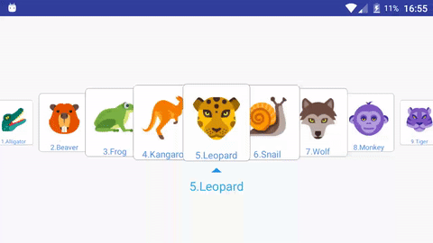
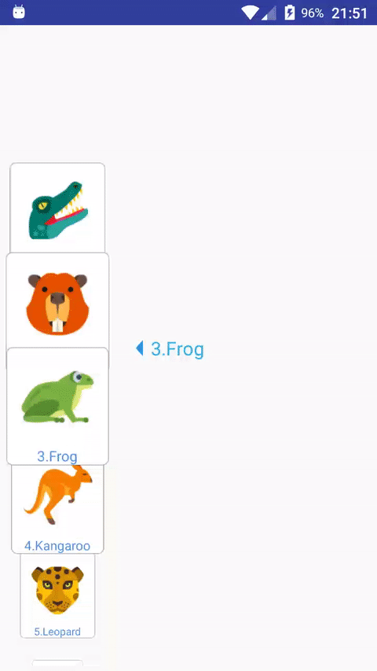

#Coverflow For Android
###Demo gif as below:

 

###About:
It's extends RecyclerView.

###Scroll infinity

    <cn.wxhyi.coverflow.CoverFlowView
        xmlns:cfv="http://schemas.android.com/apk/res/cn.wxhyi.coverflow"
        android:id="@+id/cover_flow"
        android:layout_marginTop="100dp"
        android:layout_width="match_parent"
        android:layout_height="120dp"
        cfv:scroll_infinity="true"
        cfv:scroll_orientation="horizontal"/>
        
###Thanks:
ytumaotong1992

###Reference:
https://github.com/renard314/ListView3d  
http://stackoverflow.com/questions/10211835/android-vertical-listview-with-overlaped-rows 
http://stackoverflow.com/questions/25684167/recyclerview-does-not-scroll-as-expected 
http://sapandiwakar.in/recycler-view-item-click-handler/  
Free image source from https://icons8.com/